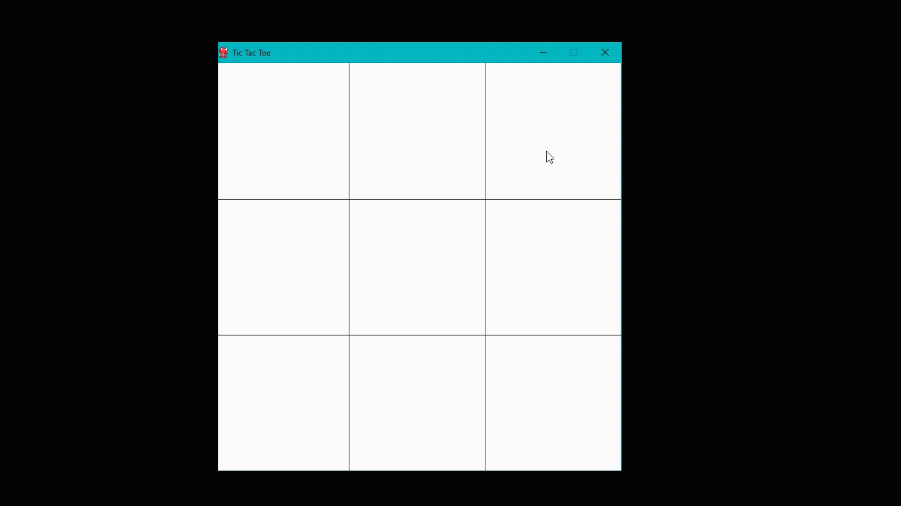

<h1 align="center">Tic-Tac-Toe-AI</h1>

  Play Tic-Tac-Toe against an AI and see if you can beat it!

<!-- TABLE OF CONTENTS -->
## Table of Contents
* [About the Project](#about-the-project)
* [Tech Stack](#tech-stack)
* [Contact](#contact)

## About the Project

The computer uses strategy to beat the opposite player.

## Tech Stack
- Python
- Pygame

## Contact

Twitter : [abrohit05](https://twitter.com/abrohit05)

LinkedIn : [Rohit Manjunath](https://www.linkedin.com/in/rohitmanjunath/)

Website : [abrohit](https://abrohit.pythonanywhere.com/)
